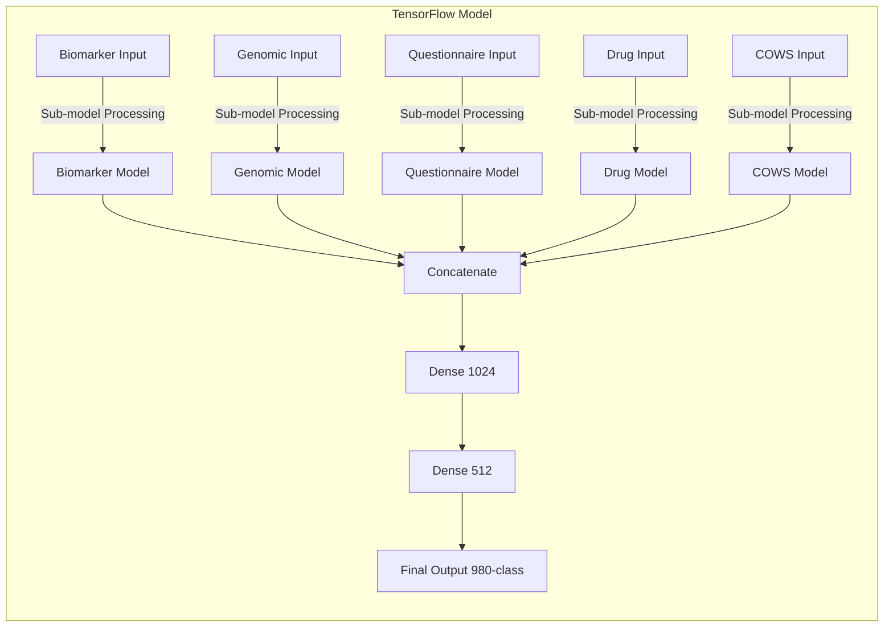

```mermaid
graph LR
  BI[Biomarker Input] -->|Sub-model Processing| BM[Biomarker Model]
  GI[Genomic Input] -->|Sub-model Processing| GM[Genomic Model]
  QI[Questionnaire Input] -->|Sub-model Processing| QM[Questionnaire Model]
  DI[Drug Input] -->|Sub-model Processing| DM[Drug Model]
  CI[COWS Input] -->|Sub-model Processing| CM[COWS Model]

  BM --> C[Concatenate]
  GM --> C
  QM --> C
  DM --> C
  CM --> C

  C --> D1[Dense 1024]
  D1 --> D2[Dense 512]
  D2 --> FO[Final Output 980-class]

  subgraph TensorFlow Model
      BI
      GI
      QI
      DI
      CI
      BM
      GM
      QM
      DM
      CM
      C
      D1
      D2
      FO
  end
```
