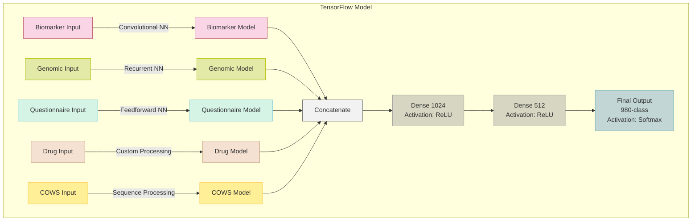

```mermaid
graph TD
  style BI fill:#f9d5e5,stroke:#b84a62
  style GI fill:#e3eaa7,stroke:#b3c100
  style QI fill:#d5f4e6,stroke:#80ced6
  style DI fill:#f4e1d2,stroke:#be9b7b
  style CI fill:#ffef96,stroke:#ffcc5c

  style BM fill:#f9d5e5,stroke:#b84a62
  style GM fill:#e3eaa7,stroke:#b3c100
  style QM fill:#d5f4e6,stroke:#80ced6
  style DM fill:#f4e1d2,stroke:#be9b7b
  style CM fill:#ffef96,stroke:#ffcc5c

  style C fill:#f2f2f2,stroke:#666
  style D1 fill:#d6d6c2,stroke:#999
  style D2 fill:#d6d6c2,stroke:#999
  style FO fill:#c2d6d6,stroke:#66b2b2

  BI[Biomarker Input] -->|Convolutional NN| BM[Biomarker Model]
  GI[Genomic Input] -->|Recurrent NN| GM[Genomic Model]
  QI[Questionnaire Input] -->|Feedforward NN| QM[Questionnaire Model]
  DI[Drug Input] -->|Custom Processing| DM[Drug Model]
  CI[COWS Input] -->|Sequence Processing| CM[COWS Model]

  BM --> C[Concatenate]
  GM --> C
  QM --> C
  DM --> C
  CM --> C

  C --> D1[Dense 1024\nActivation: ReLU]
  D1 --> D2[Dense 512\nActivation: ReLU]
  D2 --> FO[Final Output\n980-class\nActivation: Softmax]

  subgraph TensorFlow Model
      BI
      GI
      QI
      DI
      CI
      BM
      GM
      QM
      DM
      CM
      C
      D1
      D2
      FO
  end
```
